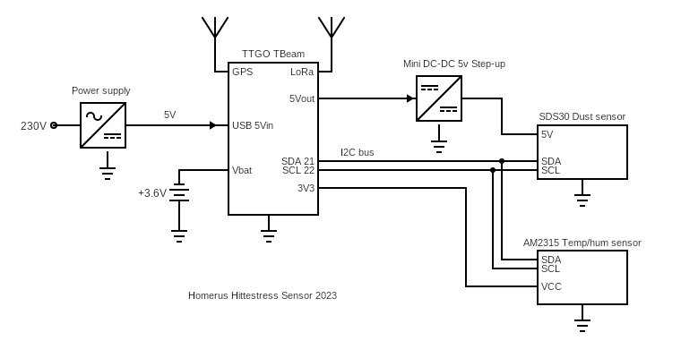

# Homerus Climate sensor 2023
These climate sensors are designed for the Homerus-Energiek project in Apeldoorn.  
They are mounted in 6 lampposts.

## Requirements 
- each 2 minutes the sensor measures and sends the following parameters to the network:
   - temperature
   - humidity
   - Dust PM 1.0, PM 2.5 and PM 10
- radio communication by means of LoRaWan TTN OTAA
- can be mounted on lamppost (case IP65)
- LiPo battery management, charged at night (when lamppost is on)
- Supply 230V
- GPS location and battery voltage are reported at regular intervals

## Realization

 Climate Sensor in Kradex housing

 

Air inlet dust sensor, with insect sreen

## Hardware:
- LilyGO TTGO T-Beam - LoRa 868MHz - NEO-M8N GPS - ESP32 
- Sensirion SPS30 Particulate matter sensor i2c
- AM2315C Temperature/humidity sensor i2c
- 18650 Li-ion Batterij - 2600mAh
- Hi-Link PCB Voeding - 5VDC 1A
- Mini DC-DC 5V Step-up Boost Converter 480mA
- PCB for connecting components
- Kradex housing 176x126x57mm - IP65

There are 2 types of TTGO T-Beam versions:
- TTGO T-Beam V1.2 with LoRa SX1262
- TTGO T-Beam V1.2 with LoRa SX1276

For this reason we use the LoRa LacunaSpace basicmac library wich supports both LoRa chips SX1262 and SX1276

## Electronic diagram

## Software 

### Prerequisites:
- Visual Studio with Platform IO
- LacunaSpace/basicmac LoRa library
- mikalhart/TinyGPSPlus GPS library
- sensirion/sensirion-sps particicle matter SPS30 library
- lewisxhe/AXP202X_Library power control T-Beam
- RobTillaart/AM2315C library for the i2c AM2315C sensor
- espressif32@3.5.0 platform with board ttgo-t-beam

All libraries are defined in paltformio.ini and will be loaded automatically when the project is opened, except for the LacunaSpace/basicmac LoRa library.

### Install LacunaSpace/basicmac manually
Download the LacunaSpace/basicmac zip library from https://github.com/LacunaSpace/basicmac.
Run the script ./target/arduino/export.sh or ./target/arduino/export.bat to export the necessary files to a specific location. Specify this location in your platformio.ini file.

## Instructions
### Change the parameters in the basicmap library if necesssary.
In the file hal/target-config.h some parameters are defined, defaults are:
> #define CFG_eu868 1  
> #define BRD_sx1262_radio 1

Change the paramaters by (un)commenting those lines accodingly, if you have a sx1276 board or you are outside Europe.

### LoRaWan TTN keys
In the file configuration.h the TTN keys APPEUI an APPKEY are defined.
The unique DEVEUI key is obtained from the T-BEAM board id.
